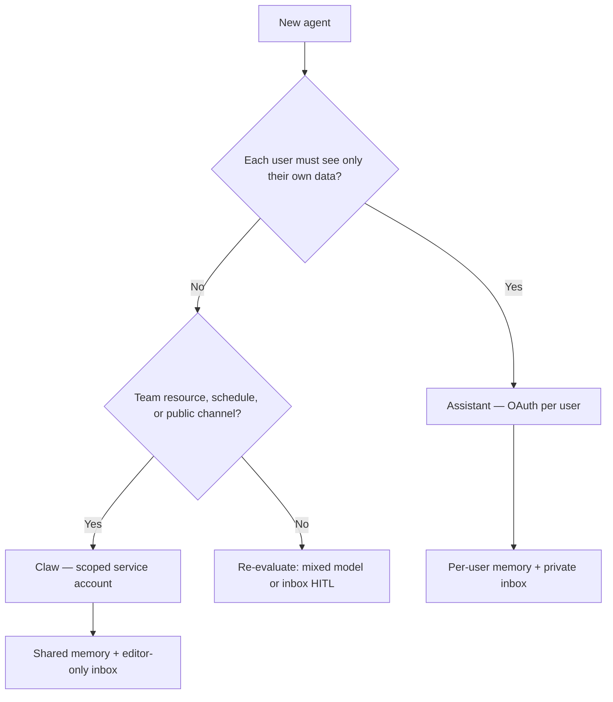

# How to Choose (Without Getting Burned)

The fork is not about intelligence or autonomy. It is **whose keys are in the lock**.

## Pick an Assistant when

- Each user must see only their own data
- Audit trails should read "Alice did X," not "the bot did X"
- Personalization is the point

**Examples:** onboarding agent, personal Notion assistant, per-user Rippling lookup.

## Pick a Claw when

- The agent is a team resource (`@vendor-intake`, `@it-help`, `@product-bot`)
- It runs on a schedule or listens on a channel without a logged-in human
- You want a deliberately scoped service account — not the union of every user's access

**Examples:** email agent, competitor monitor, vendor intake bot, weekly-numbers Slack agent.

## Common mistake

Building a **Claw** with your **personal OAuth**.

Anyone who can message the bot inherits everything you can see. The fix is not "make it an Assistant" — it is give the Claw its own account with only the permissions the job needs.

Run the anti-pattern demo: `avc-slack` or `pytest tests/test_anti_patterns.py -q`

## Beyond credentials

| Concern | Assistant | Claw |
|---------|-----------|------|
| Memory | Per-user threads | Shared team resource |
| Inbox | Private per-user for sensitive work | Editor-only review before sensitive actions |
| Channels | Needs user ID mapping (Slack → LangSmith user) | Can drop into more surfaces — only needs the message, not who you are |

See [`src/identity_models/memory.py`](../src/identity_models/memory.py) and [`src/identity_models/inbox.py`](../src/identity_models/inbox.py).

## Fleet mapping

See [FLEET_MAPPING.md](./FLEET_MAPPING.md) for how these patterns map to LangSmith Fleet primitives.

## One sentence

> Whose identity should execute that task — the human in the loop, or the agent we provisioned for the job?

**Assistants** work for you, as you.  
**Claws** work as themselves, on behalf of the team.