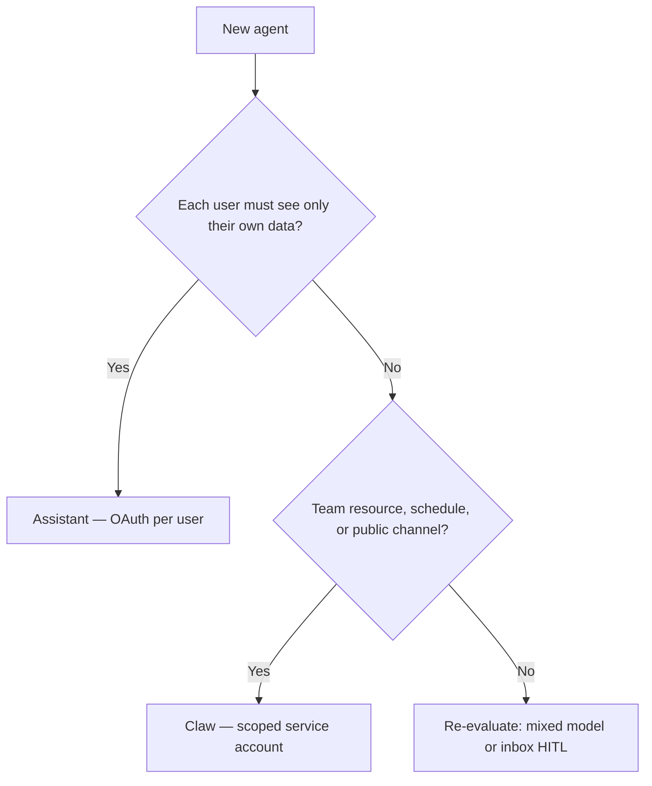

# Assistant vs Claw

**On-behalf-of Assistants and fixed-identity Claws** — and why the distinction matters the moment you share an agent.

[View on GitHub](https://github.com/cobusgreyling/assistant-vs-claw) · [Fleet Engineering](https://github.com/cobusgreyling/fleet-engineering)

## The fork

| | **Assistant** | **Claw** |
|---|---------------|----------|
| Acts as | The person using it | Itself |
| Credentials | Per-user, at runtime | Fixed, at setup |
| Data scope | Whatever that user can see | Whatever the agent account can see |

## Decision guide



## Quick start

```bash
git clone https://github.com/cobusgreyling/assistant-vs-claw.git
cd assistant-vs-claw
python -m venv .venv && source .venv/bin/activate
pip install -e ".[dev]"
avc-compare
pytest -q
```

## Console commands

| Command | Scenario |
|---------|----------|
| `avc-compare` | Full side-by-side comparison |
| `avc-onboarding` | Assistant onboarding agent |
| `avc-email` | Claw email agent |
| `avc-product` | Claw product bot |
| `avc-slack` | Side-by-side Slack + anti-pattern |
| `avc-vendor` | Claw vendor intake bot |

## Try in Colab

Open the [Colab notebook](https://colab.research.google.com/github/cobusgreyling/assistant-vs-claw/blob/main/notebooks/assistant_vs_claw.ipynb) — no local setup required.

## Further reading

- [How to Choose](./CHOOSING.md)
- [Fleet Mapping](./FLEET_MAPPING.md)
- [Essay hook](./ESSAY_HOOK.md)